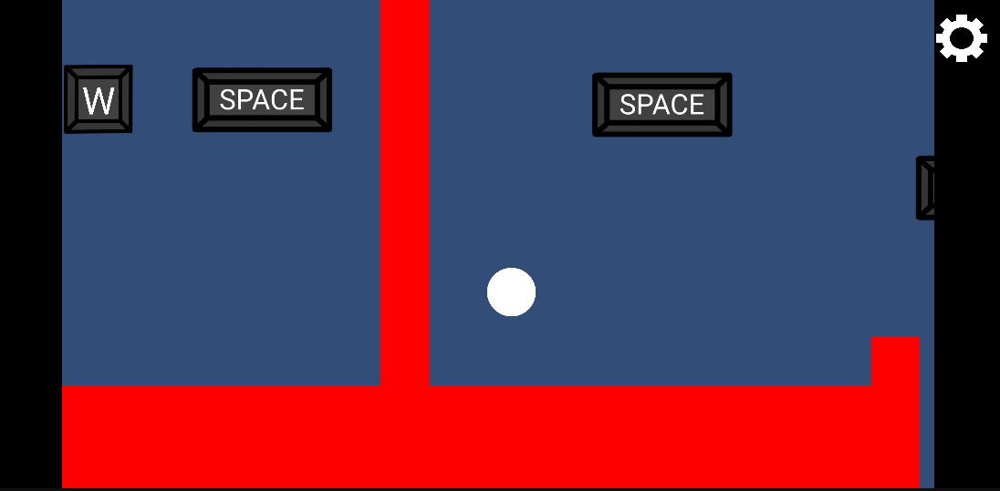

# The Dimensions Door

A platformer where you shift between dimensions to solve puzzles and get past obstacles.

## Play it
[(https://pineappleblue.itch.io/dimensions-door)]
Note: You have to go full screen to get to UI. Additionally, the UI stays even after closing it; you just have to un-full screen and re-full screen. I believe this is an error in itch.io.

## Controls
- Move: WASD
- Dash: LEFT Shift
- Shift Dimension: [Space]
- All controls are adjustable in settings

## Screenshot

